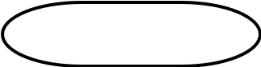
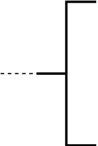
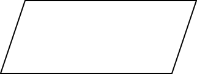
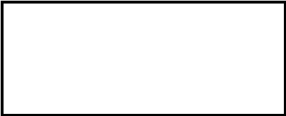
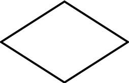
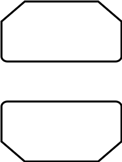
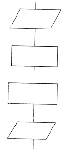
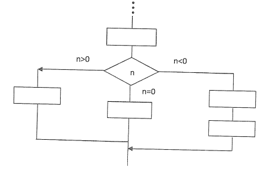
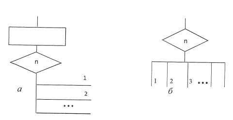
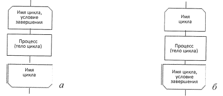

# Блок-схема

Одним из распространенных способов записи алгоритмов является блок-схема. Точнее так наверное когда-то и было, но сейчас
есть множество других инструментов и диаграмм для описания алгоритмов. Но блок-схемы до сих пор хорошо живут в ВУЗ-ах и
студенческих работах.

## ГОСТ 19.70 1-90 (ИСО 5807-85)

Как почти со всем, что касается "информатики", "разработки ПО" существует ГОСТ и для блок-схем - **ГОСТ 19.70 1-90 (ИСО
5807-85)**

## Основные типы блочных символов

Выделяют блочные символы следующих основных типов:

- **Результативные (обработки информации).** Выполнение операций в
  собственном смысле этого слова. Каждая такая операция изображается
  прямоугольником. Из прямоугольника выходит одна линия — результативное
  действие всегда имеет одного преемника.
- **Вспомогательные (НАЧАЛО и КОНЕЦ).** Указывающие, с какого
  действия начинается выполнение алгоритма (вход в алгоритм) и каким оно
  завершается (выход из алгоритма).
- **Ветвление**. такие действия изображаются ромбами; у каждого
  ромба в простейшем случае два выхода: один, снабжённый комментарием Да
  (Истина, 1), указывает преемника в том случае, когда записанное внутри ромба
  условие выполнено; другой, снабжённый комментарием Нет (Ложь, 0), — в том
  случае, когда это условие не выполнено. Число выходов может быть больше
  двух.
- **Ввод-вывод**. Такие действия могут изображаться различными блоками
  в зависимости от носителя информации (когда-то источником были и перфокарты, и дискеты и для всего этого были
  отдельные обозначения). Смысл этой операции заключается в том, что в блоке перечисляют наименования переменных,
  значения которых
  необходимо ввести в вычислительный процесс или выдать в качестве результата
  (например, на экран монитора).

## Соединение блоков

Блок-схемы алгоритмов строят из блочных символов различных типов,
соединяя их линиями-связями (линиями потока). Линии потока указывают
последовательность выполнения блоков и предписанных блоками действий.

Направления линий потока сверху вниз и слева направо следует принимать
за основные и, если линии потока в этих направлениях не имеют изломов, их
можно не обозначать стрелками. В остальных случаях направления линий потока
стрелками обозначать обязательно (вообще лучше всегда просто написать стрелочку, это не сложно).

# Основные блочные символы

| Обозначение                                           | Описание                                                                                                                                                                                                                                                                                                                                                                                                                                    |
|-------------------------------------------------------|---------------------------------------------------------------------------------------------------------------------------------------------------------------------------------------------------------------------------------------------------------------------------------------------------------------------------------------------------------------------------------------------------------------------------------------------|
|                  | **Терминатор** (Начало/Конец) - вход/выход их алгоритма. Символ отображает выход во внешнюю среду и вход из внешней среды (начало или конец схемы программы, внешнее терминатор использование и источник или пункт назначения Данных)                                                                                                                                                                                                       |
|                    | **Соединитель** Символ отображает выход в часть схемы и вход из другой части этой схемы и используется для обрыва линии и продолжения её в другом месте. Соответствующие символьны-соединители должны содержать одно и то же уникальное обозначение. _Не надо уменьшать схему чтобы впихнуть её на страницу - схему можно поделить._                                                                                                        |
|                        | **Комментарий** Символ используют для добавления описательных комментариев или пояснительных записей в целях объяснения или примечаний. Пунктирные линии в символе комментария связаны с соответствующим символом или могут обводить группу символов. Текст комментариев или примечаний должен быть помещен около ограничивающей фигуры.                                                                                                    |                                                                                                                                                                                                                                                                                                                     | |                                                                                                                                                                                                                                                                                                                                    |                                                                                                                                                                                                                                       |
|                            | **Данные** (Ввод с неизвестного источника). _Просто всегда для ввода используйте понятие неизвестного источника и норм._                                                                                                                                                                                                                                                                                                                    |
|                        | **Процесс** (любая обработка данных).   Символ отображает функцию обработки данных любого вида (выполнение определенной операции или группы операций, приводящее к изменению значения, формы или размещения информации или к определению, по которому из нескольких направлений потока следует двигаться)                                                                                                                                   |
|  | **Предопределенный процесс** (функции/другие программы, которые уже известны/описаны). Символ отображает предопределённый процесс, состоящий из одной или нескольких операций или шагов программы, которые определены в другом месте (в подпрограмме, модуле).                                                                                                                                                                              |
|                    | **Ветвление** (хоть обычное - ```if-else```, хоть множественное - ```if-elif-..elif-else``` или ```switch-case```)                                                                                                                                                                                                                                                                                                                          |
|                              | **Цикл** _Если говорить о каноничности и соответствии ГОСТ-у, то вообще цикл должен выглядеть так, а не описан через шестиугольник или ветвление._ Символ, состоящий из двух частей, отображает начало и конец цикла. Обе части символа имеют один и тот же идентификатор условия для инициализации приращения, завершения и тд. помещаются внутри символа в начале или в конце в зависимости от расположения операции, проверяющей условие |

## Линейная часть алгоритма

Линейный алгоритм состоит из последовательности шагов, которые выполняются только один раз в порядке их следования один
за другим (в естественном порядке). К такому процессу сводится вычисление значений величин, задаваемых формулами. На
блок-схеме линейный вычислительный процесс изображается последовательностью блочных Символов, в которых реализуется ввод
данных, вычисления по формулам и вывод результатов.



## Ветвление (2 ветви)

Разветвляющийся алгоритм содержит блок проверки некоторого условия, и в зависимости от результата проверки выполняется
та или иная последовательность операций, составляющая отдельное направление (или ветвь) алгоритма.

Для организации разветвлений используется блок "**Ветвление**", внутри которого записывается проверяемое условие. Чаще
всего
в инженерных задачах таким условием является логическое выражение <ЛВ>, содержащее в общем случае арифметические
выражения, операции отношения (```<, >, =, ~, ≥, ≠```) и логические функции (```HE, И, ИЛИ```).

В результате вычисления значения логического выражен выполнение алгоритма будет осуществляться no одному из возможных
направлений (ветвей) в зависимости от того, **истинно** полученное значение логической функции или **ложно**.

## Множественное ветвление (3 ветви)



## Множественное ветвление (n ветвей)



## Цикл

Более корректное, ГОСТ-овское определение цикла через соответсвующий оператор.

- **a)** цикл с предусловием
- **б)** цикл с постусловием

