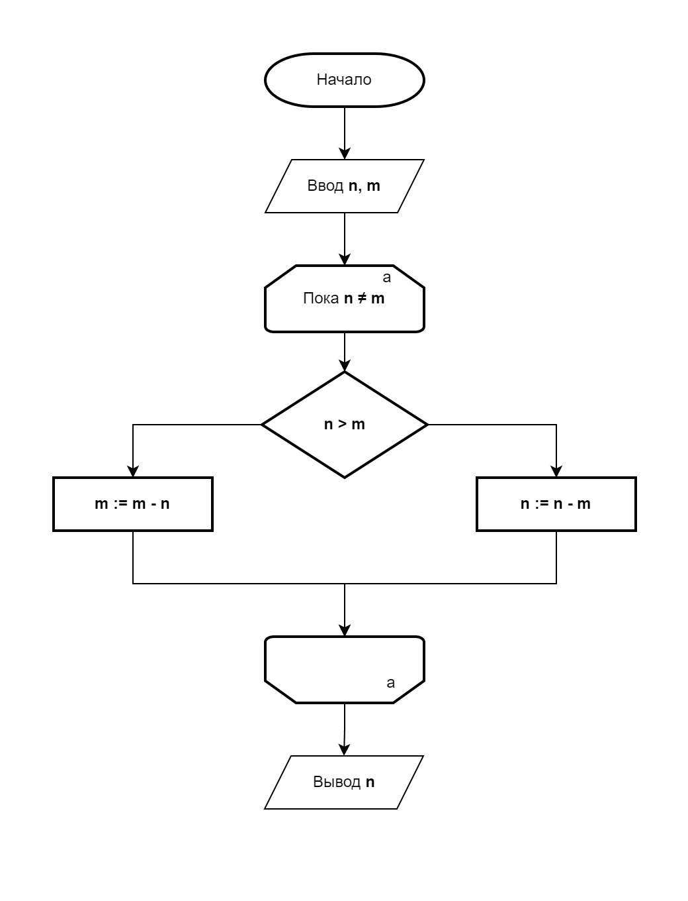

# Алгоритм Евклида

**Алгоритм Евклида** – это древний и эффективный метод для нахождения **наибольшего общего делителя (НОД)** двух целых
чисел. НОД двух чисел — это наибольшее число, на которое оба числа делятся без остатка.

## Принцип работы

Алгоритм основывается на следующем факте: НОД двух чисел ```a``` и ```b``` равен НОД ```b``` и остатка от
деления ```a``` на ```b```. Процесс повторяется до тех пор, пока остаток не станет равным нулю. Тогда ```b``` (или
последнее ненулевое значение) является наибольшим общим делителем.

### Пример кода на Python

_Не самая оптимальная реализация, но для примера хорошо подходит._

```Python
def gcd(n: int, m: int) -> int:
    """
    Находит наибольший общий делитель (НОД) двух чисел с использованием алгоритма Евклида.
    
    :param n: Первое число (целое)
    :param m: Второе число (целое)
    :return: Наибольший общий делитель чисел a и b
    """
    while n != m:
        if n > m:
            m = m - n
        else:
            n = n - m

    return n


# Пример использования:
num1 = 48
num2 = 18
print(f"НОД({num1}, {num2}) = {gcd(num1, num2)}")
```

### Блок-схема алгоритма Евклида

**Передачу параметров в функцию также считаем за ввод.**

