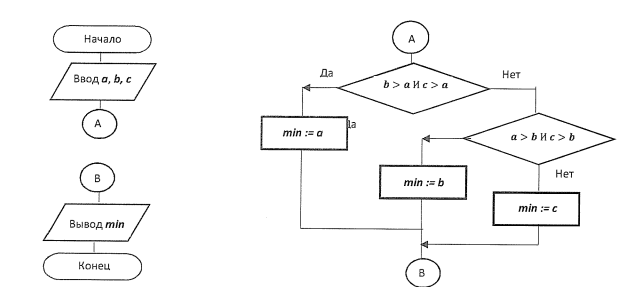

# Минимум из трех

_На основе этого простого алгоритма мы рассмотрим перенос схемы._

## Принцип работы

```min = a```, если ```b > a И c > b```
```min = b```, если ```a > b И c > b```
```c``` в противном случае

## Код на Python

```Python
def min_of_three(a, b, c):
    """
    Возвращает значение, согласно следующей логике:
      - Если b > a и c > b, то возвращается a.
      - Если a > b и c > b, то возвращается b.
      - В противном случае возвращается с.
    
    Обратите внимание, что данная логика не обязательно соответствует математически минимальному значению,
    а реализует заданный алгоритм выбора.
    
    :param a: первое число
    :param b: второе число
    :param c: третье число
    :return: a, если b > a и c > b; b, если a > b и c > b; иначе c.
    """
    if b > a and c > b:
        return a
    elif a > b and c > b:
        return b
    else:
        return c
```

## Блок-схема

Обратите внимание на то как работает соединитель. Вы вправе его вставлять где угодно в ЛИНЕЙНОЙ ЧАСТИ. Разрывать
ветвления не рекомендуется.



