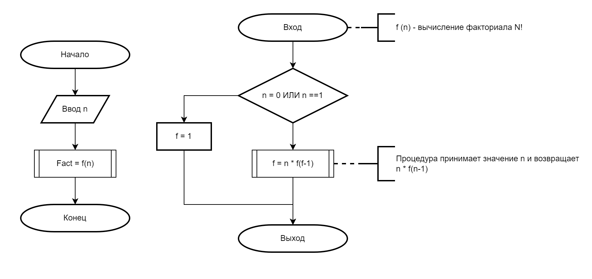

# Факториал (рекурсивный)

Факториал самый распространенный и банальный пример для рекурсивной функции.

При помощи данного примера мы рассмотрим как описать рекурсию, написать функцию и ссылаться на нее же в блок-схемах.

## Код на Python

```python
def f(n: int) -> int:
    """
    Вычисляет факториал числа n рекурсивно.
    Факториал n (обозначается n!) определяется как:
        n! = n * (n-1)!, при n > 1
        0! = 1, 1! = 1
    :param n: неотрицательное целое число
    :return: факториал числа n
    """
    # Базовый случай: факториал 0 и 1 равен 1
    if n == 0 or n == 1:
        return 1
    # Рекурсивный случай: n! = n * (n-1)!
    return n * f(n - 1)


# Пример использования:
fact = f(5)  # Выведет: 120
print(f)
```

## Блок-схема


