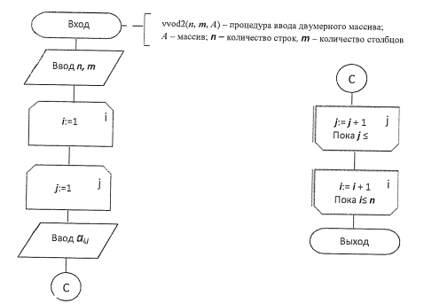

# Массивы

Работа с массивами или другими структурами выражается также циклом.

## Код на Python

Рассмотрим простой пример работы с массивом - ввод элементов.

_Пример является калькой с других языков и очень плох для реализации на Python..._

```python
def vvod2(n, m, A):
    A = [[0 for _ in range(m)] for _ in range(n)]
    for i in range(n):
        for j in range(m):
            A[i][j] = input()
    return A

print(vvod2(2, 3, []))
```

## Блок-схема

