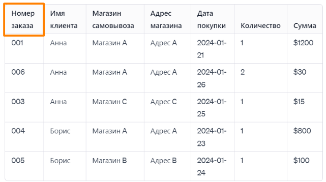
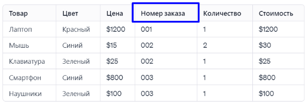
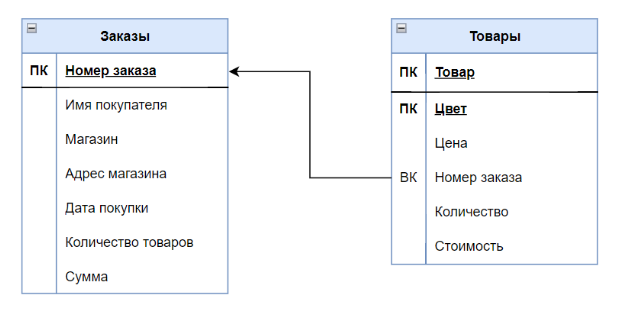

# Ключи

## Первичный ключ

**Первичный ключ** - это поле, или список полей, с помощью которого можно **однозначно идентифицировать одну строчку**.
Выделение ПК необходимо, чтобы иметь возможность найти нужную строчку, корректно делать соединения таблиц и агрегацию.
Есть пара главный свойств:

1. ПК имеет место только в рамках одной таблицы. И у каждой таблицы он свой.
2. Все значения столбца, выбранного в качестве ПК - уникальны. Не должно быть повторяющихся.

Посмотрим на пример: таблица заказов. Как отличить 1 заказ от другого?

Для этой цели и нужен первичный ключ. В нашем кейсе эту роль выполняет поле "**Номер заказа**". В данной таблице
представлены все уникальные заказы. Каждый из них имеет свой идентификатор и они НЕ повторяются.

Так как одним из условий организации данных в реляционной БД является исключение избыточности, с помощью ПК мы можем
агрегировать записи (строчки) с одинаковым ключом, а также ссылаться на какой-то заказ в других таблицах!

### Составной PK

Но! Бывают ситуации, когда одного поля для однозначной идентификации уникальной строчки недостаточно. В этом случае в
первичный ключ могут входить несколько ключевых полей. **Такой первичный ключ называется составным**.

В таблицах связи n:n PK делается составным, чтобы избежать возможности дублирования "связей".

## Внешний ключ

**Внешний ключ** - это так же поле, или комбинация полей, который ссылается на первичный ключ другой таблицы. Поэтому он
и внешний, так как принадлежит другой сущности С помощью внешнего ключа (ВК) можно подтянуть поля одной таблицы в
другую. Таким образом устанавливается связь между соответствующими записями двух таблиц.

Посмотрим на таблицу с товарами, входящими в каждый заказ в таблице выше:

В данном случае "Номер заказа" является Внешним ключом. С помощью этого ВК можно подтянуть сюда данные из таблицы с
заказами и подробного посмотреть, в какой заказ какие товары входили.
А вот первичным ключом этой таблицы будет комбинация полей: Товар и Цвет.

В ERD-диаграмме нашей импровизированной базы данных все, что мы описывали выше будет выглядеть так:

