# JOIN

```Join``` — оператор, который использую
т, чтобы объединять строки из двух или более таблиц на основе связующего столбца
между ними. Такой столбец еще называют ключом.

### Пример

Предположим, что у нас есть таблица заказов — **Orders**:

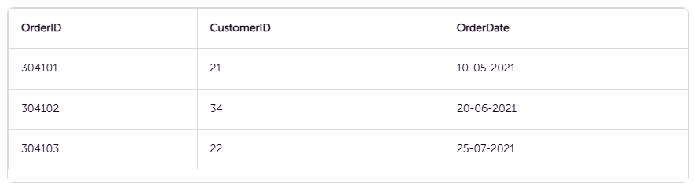

И таблица клиентов — **Customers**:

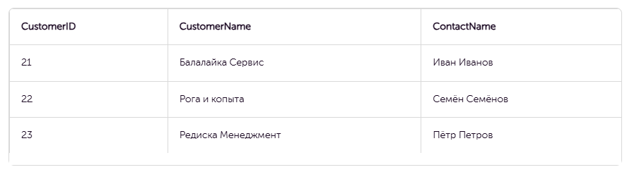

Столбец ```CustomerID``` в таблице заказов соотносится со столбцом ```CustomerID``` в таблице клиентов. То есть он —
связующий двух таблиц. Чтобы узнать, когда, какой клиент и какой заказ оформил, составьте запрос:

```sql
SELECT Orders.OrderID, Customers.CustomerName, Orders.OrderDate 
FROM Orders 
JOIN Customers 
ON Orders.CustomerID=Customers.CustomerID;
```

Результат запроса будет выглядеть так:

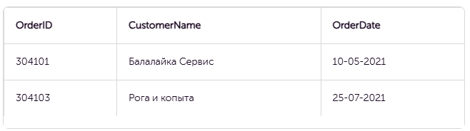

## Общий синтаксис оператора join

```JOIN``` <Название таблицы для присоединения> ```ON``` <Условие присоединения на основе связующих столбцов>

### Пример

Соединять можно и больше двух таблиц: к запросу добавьте еще один оператор join. Например, в дополнение к предыдущим
двум таблицам у нас есть таблица продавцов — **Managers**

Таблица продавцов связана с таблицей заказов столбцом ```OrderID```. Чтобы в дополнение к предыдущему запросу узнать,
какой продавец обслуживал заказ, составьте следующий запрос:

```sql
SELECT Orders.OrderID, Customers.CustomerName, Orders.OrderDate, Managers.ManagerName 
FROM Orders 
JOIN Customers 
ON Orders.CustomerID=Customers.CustomerID 
JOIN Managers 
ON Orders.OrderId=Managers.OrderId
```

## INNER JOIN - внутреннее соединение

Если использовать оператор ```INNER JOIN```, в результат запроса попадут только те записи, для которых выполняется
условие объединения. Еще одно условие — записи должны быть в обеих таблицах. В финальный результат из примера выше не
попали записи с ```CustomerID=23``` и ```OrderID=304102```: для них нет соответствия в таблицах.

Общий синтаксис запроса ```INNER JOIN```

```sql
SELECT column_name(s)
FROM table1
INNER JOIN table2
ON table1.column_name = table2.column_name;
```

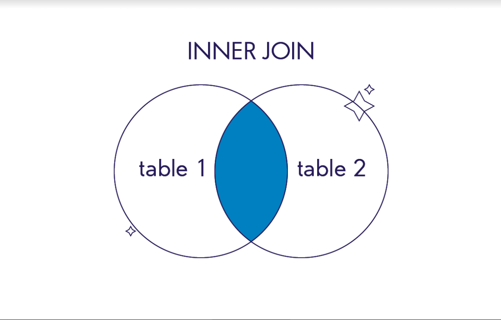

Слово ```INNER``` в запросе можно опускать, тогда общий синтаксис запроса будет выглядеть так:

```sql
SELECT column_name(s)
FROM table1
INNER JOIN table2
ON table1.column_name = table2.column_name;
```

## OUTER JOIN - внутреннее соединение

Если использовать внешнее соединение, то в результат запроса попадут не только записи с совпадениями в обеих таблицах,
но и записи одной из таблиц целиком. Этим внешнее соединение отличается от внутреннего.

Указание таблицы, из которой нужно выбрать все записи без фильтрации, называется направлением соединения.

### LEFT OUTER JOIN / LEFT JOIN

В финальный результат такого соединения попадут все записи из левой, первой таблицы. Даже если не будет ни одного
совпадения с правой. И записи из второй таблицы, для которых выполняется условие объединения.

```sql
SELECT column_name(s)
FROM table1
LEFT JOIN table2
ON table1.column_name = table2.column_name;
```

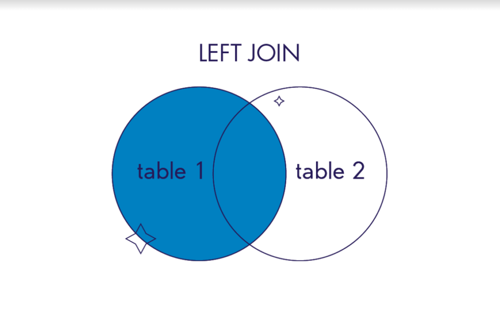

#### Пример


```sql
SELECT Orders.OrderID, Customers.CustomerName, Orders.OrderDate 
FROM Orders 
LEFT JOIN Customers 
ON Orders.CustomerID=Customers.CustomerID;
```

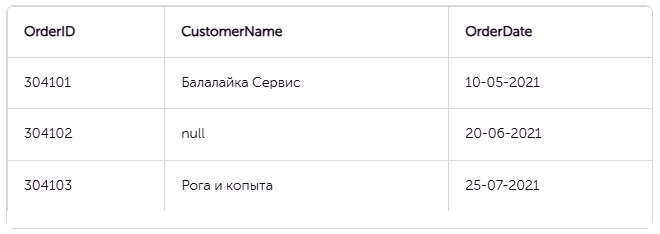

### RIGHT OUTER JOIN / RIGHT JOIN

В финальный результат этого соединения попадут все записи из правой, второй таблицы. Даже если не будет ни одного
совпадения с левой. И записи из первой таблицы, для которых выполняется условие объединения.

```sql
SELECT column_name(s)
FROM table1
RIGHT JOIN table2
ON table1.column_name = table2.column_name;
```

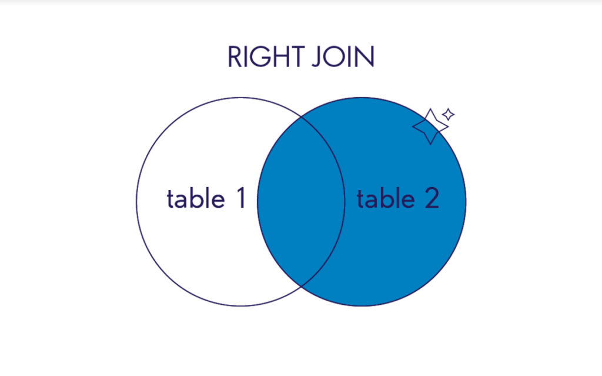

#### Пример


```sql
SELECT Orders.OrderID, Customers.CustomerName, Orders.OrderDate 
FROM Orders 
RIGHT JOIN Customers 
ON Orders.CustomerID=Customers.CustomerID;
```

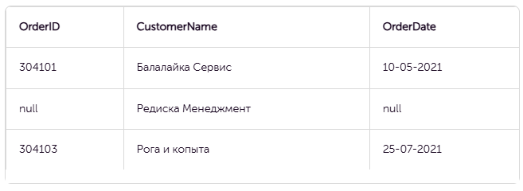

### FULL OUTER JOIN / FULL JOIN

В финальный результат такого соединения попадут все записи из обеих таблиц. Независимо от того, выполняется условие
объединения или нет.

```sql
SELECT column_name(s)
FROM table1
FULL JOIN table2
ON table1.column_name = table2.column_name;
```

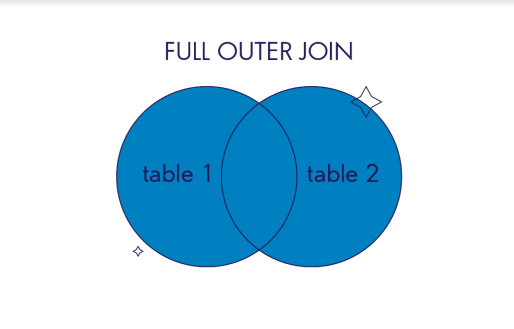

#### Пример


```sql
SELECT Orders.OrderID, Customers.CustomerName, Orders.OrderDate 
FROM Orders 
FULL JOIN Customers 
ON Orders.CustomerID=Customers.CustomerID;
```

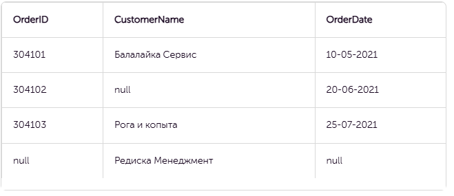

### CROSS JOIN

Этот оператор отличается от предыдущих операторов соединения: ему не нужно задавать условие объединения (```ON
table1.column_name = table2.column_name```). Записи в таблице с результатами — это результат объединения каждой записи
из
левой таблицы с записями из правой. Такое действие называют декартовым произведением.

```sql
SELECT column_name(s)
FROM table1
CROSS JOIN table2;
```

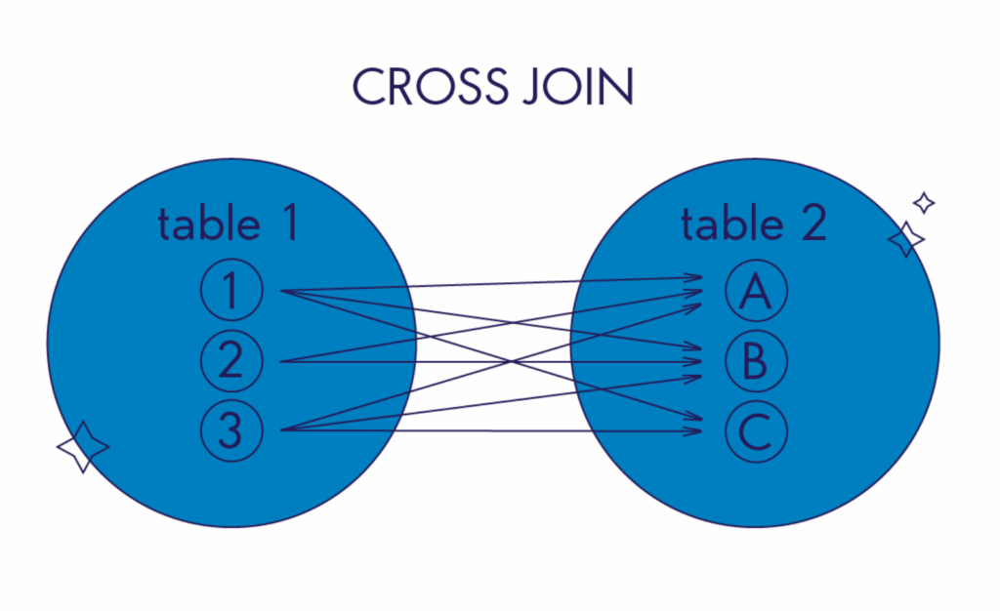

#### Пример


```sql
SELECT Orders.OrderID, Customers.CustomerName, Orders.OrderDate 
FROM Orders 
CROSS JOIN Customers;
```

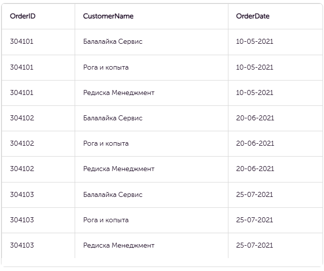

#### Примеры когда может пригодиться cross join

1. **Генерация всех возможных комбинаций:** Если у вас есть, например, таблица с возможными цветами и таблица с
   размерами, и вам нужно создать список всех комбинаций "цвет-размер" для анализа или тестирования, можно
   использовать ```CROSS JOIN```.
2. **Заполнение пропусков в отчетности:** При подготовке аналитических отчетов может понадобиться показать все возможные
   сочетания измерений (например, все даты и все регионы), даже если для некоторых комбинаций нет
   данных. ```CROSS JOIN``` позволяет создать полный список таких сочетаний, который затем можно объединить с фактами (с
   использованием ```LEFT JOIN```).
3. **Генерация тестовых данных:** Если необходимо создать большой набор тестовых данных, объединяя два набора базовых
   значений, ```CROSS JOIN``` позволяет быстро получить все возможные пары значений.
