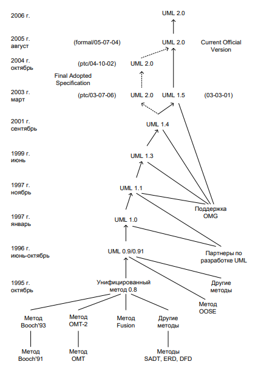

# Историческая справка о происхождении UML и UML 2.0

UML (Unified Modeling Language) появился в 1990-х годах как ответ на потребность в стандартизированном языке для
визуального моделирования программных систем. До его появления существовало множество различных методов и нотаций, таких
как OMT (Object Modeling Technique), Booch Method, OOSE (Object-Oriented Software Engineering), IDEF и другие. Это
приводило к проблемам совместимости и затрудняло обмен информацией между специалистами.

## Разработка UML 1.0

В 1994 году ведущие специалисты в области объектно-ориентированного моделирования **Гради Буч (Grady Booch)**, **Джеймс
Рамбо (James Rumbaugh)** и **Айвар Якобсон (Ivar Jacobson)** начали работу над унифицированным языком, объединяющим их
наработки. Их методики:

- **Booch Method (Гради Буч)** — использовалась для проектирования объектно-ориентированных систем;
- **OMT (Object Modeling Technique)** (Джеймс Рамбо) — фокусировалась на анализе объектов и их связях;
- **OOSE** (Object-Oriented Software Engineering) (Айвар Якобсон) — ввела концепцию вариантов использования (Use Case).

В 1995 году их совместные усилия привели к появлению **UML 0.8**, а уже в 1997 году версия **UML 1.0** была представлена
консорциуму **Object Management Group (OMG)**, который утвердил его как стандарт.

## Развитие и появление UML 2.0

С развитием технологий потребовались улучшения UML. В 2000 году OMG инициировала процесс обновления языка, и в 2003 году
была выпущена **версия UML 2.0**.

## Основные изменения в UML 2.0

1. **Расширение набора диаграмм:**
    - Добавлены новые виды диаграмм (диаграмма композитной структуры, диаграмма обзора взаимодействия).
    - Существенно улучшены диаграммы поведения (например, диаграммы последовательности и деятельности).

2. **Повышение гибкости:**
    - Введены механизмы расширения (стереотипы, ограничения, профили).
    - Улучшена возможность создания платформенно-независимых моделей (PIM) для концепции Model-Driven Architecture (
      MDA).
3. **Оптимизация метамодели:**
    - Улучшена организация элементов UML за счет четкого разделения на структурные и поведенческие части.
    - Введена поддержка сложных архитектурных решений.

# Современное состояние

На сегодняшний день UML 2.x продолжает оставаться основным стандартом визуального моделирования и используется в
различных областях: разработке программного обеспечения, бизнес-аналитике, системной инженерии и других сферах.

Таким образом, UML прошел путь от объединения нескольких подходов к мощному стандарту, который продолжает развиваться,
адаптируясь к требованиям современных технологий.

