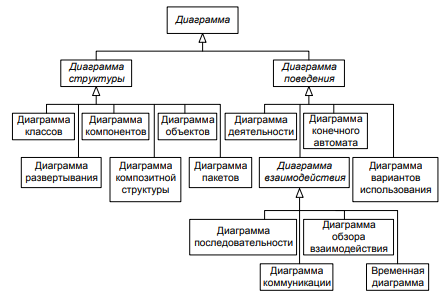

# Виды UML-диаграмм и их назначение

UML 2.0 включает **13 типов диаграмм**, которые делятся на **2 большие группы**:

1. **Диаграммы структуры** (статические)

- Описывают компоненты системы и их взаимосвязи.
- Показывают архитектуру и статическую организацию объектов.

2. Диаграммы поведения (динамические)

- Описывают процессы, взаимодействие объектов и поведение системы во времени.
- Отражают взаимодействие компонентов и последовательность действий.

- _Диаграмма вариантов использования_ (use case diagram) — диаграмма концептуального уровня, которая служит для
  представления актеров и вариантов использования системы, а также отношений между ними.
- _Диаграмма классов_ (class diagram) — диаграмма, которая служит для представления совокупности декларативных или
  статических элементов модели, таких как классы, типы, а также разнообразных отношений между ними.
- _Диаграмма композитной структуры_ (composite structure diagram) — диаграмма, которая изображает внутреннюю структуру
  классификаторов, таких как класс, компонент или кооперация, включая точки взаимодействия классификатора с другими
  частями системы.
- _Диаграмма пакетов_ (package diagram) — диаграмма логического уровня, которая служит для представления организации
  элементов модели по пакетам, а также зависимостей между пакетами, включая импорт пакетов и слияние пакетов.
- _Диаграмма объектов_ (object diagram) — диаграмма, которая служит для представления объектов и отношений между ними в
  конкретный момент времени. Она может рассматриваться как специальный случай диаграммы классов или диаграммы
  коммуникации.
- _Диаграмма последовательности_ (sequence diagram) — диаграмма, которая служит для представления взаимодействия
  элементов модели в форме последовательности сообщений и соответствующих событий на линиях жизни объектов.
- _Диаграмма деятельности_ (activity diagram) — диаграмма, которая изображает поведение объекта или системы с
  использованием моделей потока данных и потока управления.
- _Диаграмма коммуникации_ (communication diagram) — диаграмма, которая служит для представления взаимодействия между
  линиями жизни объектов в форме элементов внутренней структуры системы и передаваемых между ними сообщений
- _Диаграмма обзора взаимодействия_ (interaction overview diagram) — вариант диаграммы деятельности, которая служит для
  представления только взаимодействия потока управления в некоторой агрегированной форме
- _Временная диаграмма_ (timing diagram) — диаграмма взаимодействия, которая служит для представления изменения
  состояния или условий линии жизни отдельных экземпляров классификаторов во времени.
- _Диаграмма конечного автомата_ (state machine diagram) — диаграмма, которая служит для представления дискретного
  поведения, моделируемого посредством переходов в системах с конечным числом состояний. В частности, она может
  представлять последовательность состояний, через которые объект или система проходят в течение жизни, реагируя на
  различные события.
- _Диаграмма компонентов_ (component diagram) — диаграмма физического уровня, которая служит для представления
  программных компонентов и зависимостей между ними
- _Диаграмма развертывания_ (deployment diagram) — диаграмма физического уровня, которая служит для представления
  архитектуры распределенных программных систем. Она содержит информацию о размещении артефактов проекта системы по
  узлам, которые соединяются коммуникациями для создания сетевой инфраструктуры произвольной сложности.