# Ассоциация, агрегация, композиция

## Ассоциация

**Ассоциация** — это базовый тип связи между двумя или более классами. Она указывает, что объекты этих классов могут
взаимодействовать или быть связаны друг с другом.

- Может быть **одно- или двунаправленной** (например, класс А знает о классе Б, или оба класса знают друг о друге).
- Ассоциация не подразумевает владения или жёсткой зависимости: объекты могут существовать независимо.
- На диаграмме UML ассоциация изображается простой линией, а ее характеристики (например, кратность) могут быть указаны
  рядом.

## Агрегация

**Агрегация** — это частный случай ассоциации, который отражает слабую форму отношения «целое – часть». Она указывает,
что один класс (целое) состоит из других классов (частей), при этом части могут существовать независимо от целого.

- Изображается линией с незакрашенным ромбом (на конце, принадлежащем целому).
- Связь агрегирования подразумевает, что если целое удаляется, части могут сохраняться, так как их жизненный цикл не
  зависит строго от целого. **Пример**: класс «Отдел» агрегирует объекты класса «Сотрудник», однако сотрудник может
  существовать и без конкретного отдела (например, при переводе).

## Композиция

**Композиция** — это более сильная форма агрегации, когда часть не может существовать отдельно от целого. Она описывает
отношение «целое – неотъемлемая часть», где жизненный цикл части полностью зависит от жизненного цикла целого.

- Изображается линией с закрашенным ромбом (на конце, принадлежащем целому).
- Если целое уничтожается, то и все его составные части также уничтожаются. **Пример**: класс «Дом» композитно включает
  объекты класса «Комната». Комната не может существовать отдельно от дома, так как является его неотъемлемой частью.

## Связь и отличия между понятиями

Все три понятия представляют собой разновидности связей между классами. Они помогают моделировать, как классы
взаимодействуют или как один класс включает в себя другой.

- **Ассоциация** — самая общая форма связи. Она не накладывает никаких жёстких ограничений на жизненный цикл объектов.
- **Агрегация** — это ассоциация со слабой зависимостью «целое – часть», где часть может существовать независимо от
  целого.
- **Композиция** — это агрегация с сильной зависимостью, где жизненный цикл части строго связан с целым и не может
  существовать без него.

# Диаграмма классов: общие сведения

Диаграмма классов является одной из основных статических UML-диаграмм и играет ключевую роль в описании архитектуры
системы.

Диаграмма классов используется для визуального представления структуры системы. Она описывает классы, их атрибуты,
операции (методы) и отношения между классами.

## Основные элементы

- **Классы**: Абстракции, представляющие сущности предметной области.
- **Атрибуты**: Свойства, характеризующие классы (например, имя, идентификатор, цена).
- **Операции**: Функциональность или поведение классов.
- **Связи между классами**:
    - **Ассоциация**: Отражает логическую связь между классами.
    - **Обобщение (наследование)**: Показывает иерархию, где один класс наследует свойства и методы другого.
    - **Агрегация и композиция**: Указывают на "часть-целое" отношения между классами.
    - **Зависимость**: Описывает временные или слабые отношения между классами.

## На какой стадии разработки используется диаграмма классов?

- **Анализ требований:** На ранних этапах проектирования диаграмма классов помогает выявить ключевые сущности предметной
  области и определить их основные свойства и отношения. Это позволяет согласовать терминологию и понять бизнес-логику
  системы.
- **Проектирование (дизайн):** На этой стадии диаграмма классов используется для детальной проработки архитектуры
  системы, планирования взаимодействия между классами и подготовки к реализации. Здесь определяется структура
  приложения, что впоследствии упрощает разработку и поддержку.
- **Генерация кода:** Многие CASE-инструменты могут автоматически генерировать исходный код на основе диаграммы классов.
  Это ускоряет переход от модели к реализации.
- **Документирование:** Диаграмма классов служит важной документацией проекта, позволяющей команде разработчиков,
  тестировщиков и архитекторов понимать структуру системы на протяжении всего жизненного цикла разработки.

# Диаграмма классов

**Диаграмма классов — основная логическая модель проектируемой системы.**

_Диаграмма классов (class diagram)_ — диаграмма, предназначенная для представления модели статической структуры
программной системы в терминологии классов объектно-ориентированного программирования.

Разработка диаграммы классов преследует следующие цели:

- определить сущности предметной области и представить их в форме классов с соответствующими атрибутами и операциями;
- определить взаимосвязи между сущностями предметной области и представить их в форме типовых отношений между классами;
- разработать исходную логическую модель программной системы для ее последующей реализации в форме физических моделей;
- подготовить документацию для последующей разработки программного кода.

## Класс

**Класс (class)** — элемент модели, который описывает множество объектов, имеющих одинаковые спецификации характеристик,
ограничений и семантики.

В языке UML 2.0 класс служит графическим представлением и формальным описанием свойств однотипных объектов, которые
обладают одинаковой структурой, поведением и отношениями с объектами из других классов. Цель класса заключается в
спецификации классификации объектов и в спецификации характеристик, которые отражают структуру и поведение этих
объектов.

Для графического изображения класса в языке UML 2.0 используется символ классификатора — прямоугольник, при этом
ключевое слово class в угловых скобках выше его имени не указывается.

Прямоугольник классификатора для класса дополнительно может быть разделен горизонтальными линиями на разделы или секции.
В этих секциях указываются имя класса, атрибуты (структурные характеристики или свойства), операции (характеристики
поведения), а также дополнительная информация, такая как ограничения или помеченные значения. Любая секция может быть
опущена или скрыта. При этом разделительная линия для опущенной секции не изображается. Если некоторая секция опущена
или скрыта, нельзя ничего сказать о наличии или отсутствии элементов в этой секции. Если необходимо, то для устранения
двусмысленности могут быть использованы имена секций. Тип, видимость, значение по умолчанию, кратность, строка-свойство
могут не отображаться, даже если они существуют в модели.

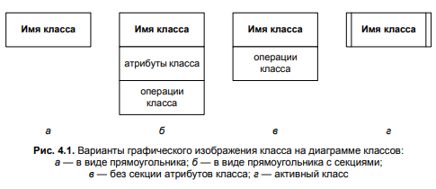

Обязательным элементом при обозначении класса является его имя, которое всегда записывается в верхней секции
прямоугольника класса. При этом класс может обозначаться прямоугольником без дополнительных секций с указанием только
имени класса (рис. 4.1, а), что характерно для начальных этапов разработки диаграммы. По мере дальнейшей разработки
диаграммы классов их обозначения дополняются секциями атрибутов и операций (рис. 4.1, б). Если секция атрибутов или
операций является пустой, то в языке UML 2.0 допускается ее вовсе не указывать (рис. 4.1, в).

### Абстрактный класс

Класс может не иметь экземпляров или объектов. В этом случае он называется **абстрактным (abstract)** классом, а для
обозначения его имени используется наклонный шрифт (курсив). В языке UML 2.0 принято общее соглашение о том, что любой
текст, относящийся к абстрактному элементу, записывается курсивом.

Курсив при записи имени класса, в отличие от толщины шрифта, имеет принципиальное значение, поскольку является
семантическим аспектом описания абстрактных элементов языка UML 2.0. Именно по этой причине разработчикам следует
внимательно записывать имена классов.

### Атрибуты класса

Атрибут (attribute) класса служит для представления отдельной структурной характеристики или свойства, которое является
общим для всех объектов данного класса.

В общем случае атрибут представляет собой структурную характеристику или свойство, относящееся к классификатору или
концу ассоциации. Атрибут устанавливает отношение экземпляра класса со значением или коллекций значений типа атрибута.
Если свойство является атрибутом классификатора, то его значение или значения относятся к экземпляру классификатора
посредством заполнения слотов этого экземпляра. Если свойство является собственностью классификатора, отличным от
ассоциации, то оно представляет атрибут класса или типа данных. Атрибуты класса записываются во второй сверху секции
прямоугольника класса, которую называют секцией атрибутов. При этом все спецификации атрибутов выравниваются слева.
Следует показывать полные спецификации атрибутов, когда это необходимо, и скрывать их в других случаях. Каждому атрибуту
класса в языке UML 2.0 соответствует отдельная строка текста.

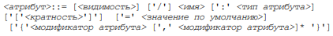

- ```<видимость>::= '+' | '–' | '#' | '~'```. Другими словами, видимость (visibility) может принимать одно из 4-х
  возможных значений и отображаться либо посредством специального символа, либо соответствующего ключевого слова. Более
  подробно семантика значений видимости рассматривается далее;
- ```/``` означает, что атрибут является производным (derive). Значение производного атрибута может быть вычислено на
  основе значений других атрибутов этого или других классов. Поэтому данный атрибут называют иногда вычислимым. При
  использовании производных атрибутов разработчик должен явно указать процедуру или операцию для вычисления их значений;
- ````<имя>```` (name) представляет собой строку текста, которая используется в качестве идентификатора соответствующего
  атрибута и поэтому должна быть уникальной в пределах данного класса. Имя атрибута является единственным обязательным
  элементом в обозначении атрибута, должно начинаться со строчной (малой) буквы и, как правило, не должно содержать
  пробелов. Относительно выбора языка для записи имени атрибута имеют место рекомендации, аналогичные рассмотренным выше
  рекомендациям по записи имен классов;
- ```<тип атрибута>``` (attribute type) есть имя классификатора, который является типом данного атрибута. Тип атрибута
  представляет собой имя некоторого типа данных, определенного или в пакете Типы данных языка UML 2.0, или самим
  разработчиком. Типы атрибутов классов часто соответствуют основным типам данных того языка программирования, который
  предполагается использовать для реализации данной модели. В общем случае тип атрибута записывается строкой текста,
  имеющей осмысленное значение в пределах пакета или модели, к которому относится рассматриваемый класс. Типу атрибута
  должно предшествовать двоеточие;
- ```<кратность>``` (multiplicity) атрибута характеризует общее количество конкретных значений для атрибута, которые
  могут быть заданы для объектов данного класса. Более подробно семантика кратности рассматривается далее;
- ```<значение по умолчанию>``` (default) — некоторое выражение, которое служит для задания начального значения или
  значений данного атрибута в момент создания отдельного экземпляра соответствующего класса. Конкретное значение по
  умолчанию должно соответствовать типу данного атрибута. Если этот терм не указан, то значение атрибута на момент
  создания нового экземпляра класса не определено. С другой стороны, конструктор соответствующего объекта может
  переопределять исходное значение в процессе выполнения программы, если в этом возникает необходимость;
- ```<модификатор атрибута>``` (attribute modifier) представляет собой текстовое выражение, которое придает
  дополнительную семантику данному атрибуту. При этом набор возможных модификаторов атрибутов в языке UML 2.0 фиксирован
  и может быть представлен в следующем виде (
  БНФ): ```<модификатор атрибута>::= 'readOnly' | 'union' | 'subsets' <имя атрибута> | 'redefines' <имя атрибута> | 'ordered' | 'unique' | <ограничение атрибута>```

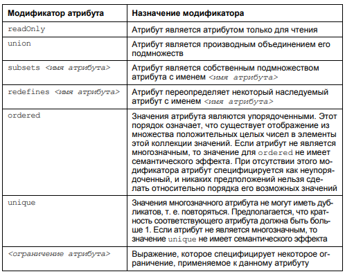

#### Статические атрибуты

При задании атрибутов может быть использована дополнительная синтаксическая конструкция — подчеркивание строки атрибута.
Подчеркивание строки атрибута означает, что значение соответствующего атрибута является статическим, т. е. одинаковым
для всех экземпляров данного класса (аналог ключевого слова static в некоторых языках программирования).

#### Видимость

Вид видимости является типом перечисления, который определяет значения в форме литералов для определения видимости
элементов в модели. Вид видимости является перечислением следующих значений литералов:

- ```+``` **public (общедоступный)**. Общедоступный элемент является видимым всеми элементами, который имеют доступ к
  содержимому пространства имен, который им владеет;
- ```-``` **private (закрытый)**. Закрытый элемент является видимым только внутри пространства имен, который им владеет;
- ```#``` **protected (защищенный)**. Защищенный элемент является видимым для элементов, которые имеют отношение
  обобщения с пространством имен, который им владеет;
- ```~``` **package (пакет)**. Элемент, помеченный как имеющий пакетную видимость, является видимым всеми элементами в
  ближайшем охватывающем пакете. За пределами ближайшего охватывающего пакета элемент, помеченный как имеющий пакетную
  видимость, не является видимым.

#### Кратность

_Кратность (multiplicity)_ является спецификацией допустимой мощности множества при инстанцировании соответствующего
элемента модели.

В языке UML 2.0 кратность может относиться к различным элементам модели (атрибутам, классам, концам ассоциаций).
Кратность специфицируется как интервал целых чисел, начиная с нижней границы и заканчивая (возможно бесконечной) верхней
границей. В общем случае спецификация кратности изображается в форме строки текста, содержащей границы интервала и
необязательную спецификацию порядка и уникальности. Спецификация кратности в нотации БНФ имеет следующий формат:

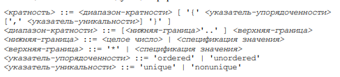

#### Пример записи атрибутов

Можно привести следующие примеры записи атрибутов для класса ```Сотрудник```:

- ```+ имяСотрудника : String {readOnly}``` — здесь ```имяСотрудника``` является именем общедоступного атрибута, который
  служит для представления информации только об имени конкретного сотрудника. Тип атрибута ```String (Строка)```
  указывает на тот факт, что отдельное значение имени сотрудника представляет собой строку текста из одного слова (
  например, 'Кирилл' или 'Мария'). Модификатор ```readOnly``` указывает на тот факт, что после задания этого имени при
  инстанцировании объекта соответствующего класса оно не может быть изменено;
- ```~ датаРождения : Data {readOnly}``` — атрибут с пакетной видимостью и типом ```Data (Дата)```, который должен быть
  дополнительно определен в модели. Модификатор readOnly указывает на тот факт, что после задания значения этого
  атрибута оно не может быть изменено;
- ```# /возрастСотрудника : Integer``` — производный атрибут с защищенной видимостью и простейшим типом Integer (Целое).
  Значение этого атрибута может быть вычислено как разность между текущей датой и датой рождения соответствующего
  сотрудника;
- ```+ номерТелефона : Integer [*] {unique}``` — общедоступный атрибут, используемый в форме коллекции значений, когда у
  сотрудников рассматриваемой организации может быть несколько телефонных номеров, а может и не быть ни одного. На это
  указывает кратность атрибута в форме звездочки. В то же время среди номеров телефонов любого сотрудника не должно быть
  повторяющихся значений. Именно на этот факт указывает модификатор ```unique```;
- ```– заработнаяПлата : Currency = $500``` — закрытый атрибут с типом ```Currency (Денежный)```, который должен быть
  дополнительно определен в модели. При создании новых экземпляров класса ```Сотрудник```, чему соответствует, например,
  прием сотрудника на работу, для него по умолчанию устанавливается заработная плата в ```$500```. В последующем это
  значение может быть изменено.

### Операции класса (методы)

_Операция (operation)_ класса служит для представления отдельной характеристики поведения, которая является общей для
всех объектов данного класса.

В общем случае операция является характеристикой поведения классификатора, которая специфицирует имя, тип, параметры и
ограничения для вызова соответствующего поведения. Операция класса специфицирует некоторый сервис, который предоставляет
каждый экземпляр или объект класса по требованию своих клиентов. В качестве клиентов операций могут выступать экземпляры
различных классов, в том числе и экземпляры данного класса. Операции класса записываются в отдельной секции
прямоугольника класса, которая, при наличии секции атрибутов, является третьей сверху. Эту секцию называют также секцией
операций. Совокупность всех операций характеризует функциональный аспект поведения всех объектов данного класса.

Запись операций класса в языке UML 2.0 также стандартизована и подчиняется определенным синтаксическим правилам. Каждой
операции класса соответствует строка текста, которую называют также сигнатурой операции. Общий формат записи отдельной
операции класса следующий (БНФ):

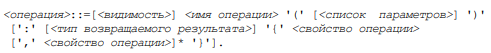

- ```<видимость> ::= '+' | '-' | '#' | '~'```, как и в случае атрибута класса, может принимать одно из четырех возможных
  значений и изображаться либо в форме специального символа, либо соответствующего ключевого слова. Напомним семантику
  этих символов и соответствующих ключевых слов. Символ + обозначает операцию с видимостью "
  общедоступная" (```public```). Символ # обозначает операцию с видимостью "защищенная" (```protected```). Символ —
  используется для обозначения операции с видимостью "закрытая" (```private```). И, наконец, символ ~ применяется для
  обозначения операции с видимостью "пакетная" (```package```). Видимость для операции может быть опущена. Это означает,
  что видимость операции не определена.
- ```<имя операции>``` (operation name) представляет собой строку текста, которая используется в качестве идентификатора
  соответствующей операции и поэтому должна быть уникальной для каждой операции данного класса. Имя операции является
  единственным обязательным элементом в обозначении операции, должно начинаться со строчной (малой) буквы и, как
  правило, не должно содержать пробелов. После имени операции должны всегда следовать круглые скобки, даже если список
  параметров является пустым.
- ```<список параметров>``` (parameter list) представляет собой перечень разделенных запятыми формальных параметров
  операции
- ```<тип возвращаемого результата>``` (return type) специфицирует тип значения, возвращаемого данной операцией.
  Двоеточие и выражение типа возвращаемого значения могут быть опущены, если операция не возвращает никакого значения.
  Для указания нескольких возвращаемых значений данный элемент спецификации операции может быть записан в виде списка
  отдельных выражений.
- ```<свойство операции>``` (operation property) служит для указания дополнительных свойств, которые могут быть
  применены к данной операции. При этом набор возможных свойств операций в языке UML 2.0 фиксирован и может быть
  представлен в следующем виде (БНФ):

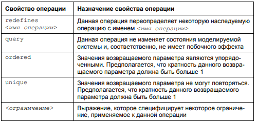

### Пример записи методов

Можно привести следующие примеры записи операций для класса ```Сотрудник```:

- ```+ добавить(номерТелефона : Integer [*] {unique})``` — общедоступная операция, которая использует многозначный
  целочисленный параметр номерТелефона в качестве передаваемых операций значений. Среди них не должно быть повторяющихся
  значений, на что указывает модификатор свойство параметра ```unique```;
- ```– изменить(заработнаяПлата : Currency)``` — закрытая операция с единственным передаваемым параметром
  заработнаяПлата типа ```Currency```;
- ```+ создать() : Boolean``` — общедоступная операция по созданию отдельного объекта класса Сотрудник, которая не
  содержит параметров. Эта операция может быть вызвана объектами любого класса в пространстве имен модели. После вызова
  данной операции она должна возвратить логическое значение.

## Отношения между классами

Кроме внутреннего устройства классов важную роль при разработке моделей программных систем имеют различные отношения
между классами, которые также могут быть изображены на диаграмме классов. Совокупность допустимых типов отношений,
которые могут быть представлены на диаграмме классов, фиксирована в языке UML 2.0. Такими типами отношений
иливзаимосвязей, которые могут быть изображены на диаграммах классов, являются отношения ассоциации и обобщения,
агрегации и композиции, зависимости и реализации.

Каждое из этих отношений имеет собственное графическое представление и
семантику, которая отражает характер и особенности соответствующей взаимосвязи между классами.

### Ассоциация

_Ассоциация (association)_ — произвольное отношение или взаимосвязь между классами.

_Бинарная ассоциация (binary association)_ обозначается сплошной линией со стрелкой или без нее, возможно, с некоторыми
дополнительными символами, которые характеризуют специальные свойства ассоциации. Линии могут быть изображены с
использованием различных стилей, включая ортогональные, наклонные и криволинейные сегменты. Выбор отдельного множества
стилей линий предоставляется пользователю.

В качестве дополнительных специальных символов могут использоваться: имя ассоциации, символ навигации, а также имена,
видимость и кратность концов ассоциации

_Имя ассоциации_ (association name) является необязательным элементом ее обозначения. Если оно задано, то записывается с
прописной (большой) буквы полужирным шрифтом и располагается рядом с символом ассоциации, но не слишком близко к ее
концу, чтобы не перепутать с именем этого конца.

- _Имя конца ассоциации специфицирует роль (role)_, которую играет класс,
  расположенный на соответствующем конце рассматриваемой ассоциации.
  Оно является необязательным, но если оно задано, то представляет собой
  строку текста, записывается со строчной (малой) буквы обычным шрифтом
  и располагается рядом с символом класса. Конец ассоциации может быть
  производным. В этом случае его имени должен предшествовать знак ```/```.
- Видимость конца ассоциации специфицирует возможность доступа к соответствующему концу ассоциации с других ее концов. В
  качестве видимости концов ассоциации используются те же значения видимости, что
  для атрибутов и операций. Если она указывается совместно с именем конца ассоциации, то записывается с помощью
  специального символа перед
  этим именем.
- _Кратность конца ассоциации специфицирует_ возможное количество экземпляров соответствующего класса, которое может
  соотноситься с одним экземпляром класса на другом конце этой ассоциации. Кратность концов ассоциации обозначается в
  виде интервала целых чисел, аналогично кратности атрибутов классов, но без прямых скобок.
- _Символ наличия навигации (navigable)_ изображается с помощью простой стрелки в форме буквы "V" на конце ассоциации.
  Наличие этой стрелки указывает на то, что соответствующий класс является доступным для навигации со стороны классов на
  других концах ассоциации.
- _Символ отсутствия навигации (non navigable)_ изображается с помощью буквы "X" на линии у конца ассоциации. Наличие
  этого символа указывает на то, что соответствующий класс является недоступным для навигации со стороны классов на
  других концах ассоциации.
- _Строка свойства (property string)_ записывается в фигурных скобках и служит для указания дополнительных свойств,
  которые имеет соответствующий конец ассоциации. При этом набор возможных свойств конца ассоциации в языке UML 2.0
  фиксирован.

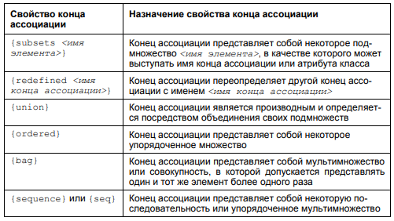

#### Пример бинарной ассоциации

В качестве примера бинарной ассоциации рассмотрим отношение между двумя классами — классом ```Компания``` и
классом ```Сотрудник```. Они
связаны между собой бинарной ассоциацией с именем ```Работает```, которое указано на рисунке рядом с линией ассоциации.
Для данного отношения определен порядок чтения ассоциации, а именно: ```Сотрудник``` ```Работает``` в ```Компании```.
Навигация для концов данной ассоциации не специфицирована. Специальные строки свойств для концов ассоциации здесь
отсутствуют.

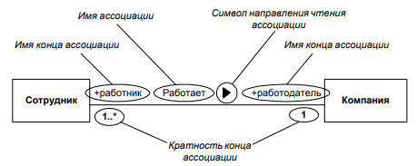

Конец ассоциации класса ```Сотрудник``` имеет имя ```работник``` , общедоступную видимость и кратность ```1..*```. Конец
ассоциации класса ```Компания``` имеет имя ```работодатель```, общедоступную видимость и кратность ```1```. Наличие
указанных кратностей будет означать, что в рамках рассматриваемой модели любой конкретной компании может соответствовать
несколько конкретных сотрудников. Это может быть легко интерпретировано в форме: в компании работают несколько
сотрудников, общее число которых заранее неизвестно и ничем не ограничено.

### N-арная ассоциация

Более общий случай представляет собой _n-арная ассоциация_ (n-ary association, читается — "эн арная ассоциация"),
которая связывает некоторым
отношением ассоциации более двух классов. В качестве значения N может выступать произвольное натуральное число больше 1.
Каждый экземпляр реализации n-арной ассоциации представляет собой n-арный кортеж, состоящий в точности из n объектов
соответствующих классов. Частным случаем n-арной ассоциации является тернарная ассоциация, которая связывает
соответствующим отношением в точности три класса (n = 3). Бинарная ассоциация также является частным случаем n-арной
ассоциации (n = 2), хотя и имеет свое собственное обозначение. Концы n-арной ассоциации для n ≥ 3 являются
собственностью этой ассоциации.

N-арная ассоциация графически обозначается ромбом, от которого ведут линии к символам классов данной ассоциации. Ромб
соединяется с символами соответствующих классов сплошными линиями, которые проводятся от вершин или от середины сторон.
Имя n-арной ассоциации записывается рядом с ромбом соответствующей ассоциации. Однако порядок классов в n-арной
ассоциации, в отличие от порядка множеств в отношении, на диаграмме классов не фиксируется.

#### Пример n-арной ассоциации

В качестве примера 4-арной ассоциации рассмотрим отношение ```Игра``` между
классами: ```Футбольная команда```, ```Год``` и ```Дата```. Данная ассоциация может представлять информацию о
состоявшихся играх футбольных команд в национальном чемпионате в течение нескольких лет.

Отдельным экземпляром ассоциации ```Игра``` может служить, например, кортеж ```<Динамо, Зенит, 17 июля, 2005>```. В
рассматриваемой модели вполне возможно, что 2 футбольные команды не провели в конкретном сезоне между собой ни одной
встречи, на что указывают соответствующие кратности концов ассоциации. Все состоявшиеся игры могут быть упорядочены по
годам и дате, на что указывает строка свойства ```{ordered}``` у соответствующих концов ассоциации.

Фрагмент диаграммы классов обладает очевидным недостатком — изображенная ассоциация не позволяет представить информацию
ни
о месте состоявшейся встречи, ни о ее результате. Для этой цели в языке UML 2.0 может быть использована специальная
конструкция, получившая название "ассоциация-класс".

### Ассоциация-класс

```Ассоциация-класс (association class)``` — элемент модели, который имеет свойства как ассоциации, так и класса, и
предназначенный для спецификации дополнительных свойств ассоциации в форме атрибутов и, возможно, операций класса.

Ассоциация-класс может рассматриваться как ассоциация, которая также имеет свойства класса, или как класс, который также
имеет свойства ассоциации. Она не только соединяет множество классов, но и определяет множество характеристик, которые
принадлежат самому отношению и не принадлежат ни одному из классов.

Семантика ассоциации-класса является комбинацией семантики обычной ассоциации и класса, поскольку в языке UML 2.0
ассоциация-класс является примером множественного наследования от метаклассов ```Ассоциация``` и ```Класс```. Это
означает, что ассоциация-класс является одновременно видом ассоциации и видом класса.

Ассоциация-класс изображается в форме символа класса, присоединенного к пути ассоциации посредством пунктирной линии.
Путь ассоциации и символ ассоциации-класса представляют один и тот же элемент модели, который имеет отдельное имя. Имя
может быть помещено на пути ассоциации, в символе класса или на обоих, но это должно быть одно и то же имя. Логически
ассоциация-класс и ассоциация являются одной и той же семантической сущностью, однако графически они различаются.
Атрибуты и операции ассоциации-класса указываются в соответствующих секциях прямоугольника класса. Ассоциация-класс
может быть использована для расширения свойств N-арной ассоциации.

В качестве примера преобразуем рассмотренную ранее 4-арную ассоциацию ```Игра``` в ассоциацию класс, что позволит
представлять информацию о результате и месте состоявшейся встречи.

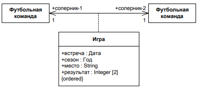

В этом случае отдельным экземпляром ассоциации класса ```Игра``` может служить, например, информация о конкретно
состоявшейся встрече, записанной в форме кортежа: ```<Динамо, Зенит, игра : Игра>```. При этом для объекта игра : Игра
задаются конкретные значения атрибутов: ```встреча = 17 июля, сезон = 2005, место = 'Москва', результат = <1, 2>```.
Поскольку значения результата упорядочены по соперникам, то в более привычной нотации они могут быть записаны в
виде: ```1 : 2```.

### Обобщение (наследование)

_Обобщение (generalization)_ — таксономическое отношение между более общим классификатором (родителем или предком) и
более специальным классификатором (дочерним или потомком).

Семантика отношения обобщения означает, что каждый экземпляр специального классификатора также является экземпляром
общего классификатора. Поэтому характеристики, специфицированные для экземпляров общего классификатора, являются неявно
специфицированными для экземпляров специального классификатора. В этом случае говорят, что специальный классификатор
наследует характеристики более общего классификатора. Любое ограничение, накладываемое на экземпляры общего
классификатора, также применимо к экземплярам специального классификатора.

Отношение обобщения является направленным и может использоваться для представления иерархических взаимосвязей между
классами, вариантами использования и другими элементами модели, которые являются классификаторами в нотации языка UML.

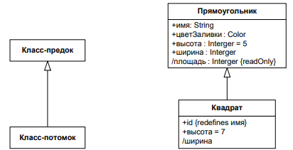

Для изображенного справа отношения обобщения класс ```Квадрат``` наследует от класса ```Прямоугольник``` все атрибуты.
Дополнительный атрибут
```id``` класса ```Квадрат``` переопределяет атрибут имя класса ```Прямоугольник```, а атрибут ```высота```
класса ```Квадрат``` имеет по умолчанию значение ```7```, вместо значения ```5``` в родительском классе.

Атрибут ```ширина``` в классе ```Квадрат``` является производным, поскольку его значение всегда равно значению
атрибута ```высота```. Хотя атрибуты ```цвет Заливки``` и ```площадь``` в классе ```Квадрат``` не указаны, они также
принадлежат этому классу. Их спецификация полностью идентична описанию в родительском классе, что следует из семантики
отношения обобщения.

Отношение обобщения, которое называют также отношением классификации или наследования, допускает, чтобы от одного
класса-предка одновременно наследовали несколько классов-потомков. Это обстоятельство отражает таксономический характер
данного отношения. В языке UML 2.0 допускается также, чтобы класс-потомок наследовал от нескольких классов-предков (так
называемое множественное наследование). Во всех этих случаях на диаграмме классов указывается несколько линий обобщения
с соответствующими стрелками. Например, класс Геометрическая фигура (курсив обозначает абстрактный класс) может
выступать в качестве родительского класса для классов потомков, соответствующих конкретным геометрическим фигурам, таким
как Прямоугольник, Окружность, Эллипс и др. Данный факт может быть представлен графически в форме следующей диаграммы
классов.

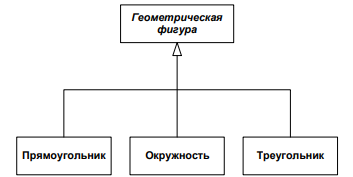

Иерархии обобщения всегда должны быть ациклическими. Другими словами, классификатор не может быть одновременно
транзитивно общим и транзитивно специальным классификатором одного и того же классификатора. Невыполнение этого условия
приводит к несогласованной диаграмме.

### Множественное обобщение (множественное наследование)

Каждое множество обобщения определяет отдельное множество отношений обобщения, которые описывают способ, которым общий
классификатор (предок) может быть разделен на несколько специальных подтипов. При этом каждая коллекция подмножеств
представляет некоторое ортогональное измерение специализации общего классификатора.

Например, можно определить множество обобщения как разбиение класса ```Человек``` на два класса: ```Мужчина```
и ```Женщина```. Здесь множество обобщения следует ассоциировать с двумя экземплярами обобщения, которые должны
иметь ```Человек``` в качестве общего класса. Однако одно отношение обобщения предполагает, что ```Мужчина``` является
специальным классом, а другое отношение предполагает, что ```Женщина``` является специальным классом. Другими словами,
можно сказать, что класс ```Человек``` разбивается на два подкласса: ```Мужчина``` и ```Женщина```.

Класс ```Человек``` может быть также классифицирован по профессиям на
классы: ```Программист```, ```Руководитель Проекта``` и ```Бизнес-аналитик```. Эта коллекция подмножеств будет
определять другое множество обобщения, которое ассоциируется с тремя другими отношениями обобщения. Все они также должны
иметь Человек в качестве общего класса. При этом эти специальные классы будут отличаться от классов Мужчина и Женщина из
другого множества обобщения. Соответствующая диаграмма классов может быть изображена так.

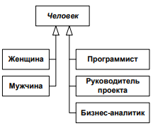

В дополнение к сказанному следует заметить, что ```Человек``` является абстрактным классом, поскольку
объект ```Человек``` не может существовать без того, чтобы быть или ```Женщиной```, или ```Мужчиной```.
Множество обобщения может содержать строку текста, указывающую на некоторые специальные свойства этого отношения. Этот
текст будет относиться ко всем линиям обобщения, которые идут к классам-потомкам данного
множества обобщения. Чтобы указать, покрывает или нет множество обобщения, а также пересекаются или нет его элементы,
каждое множество должно быть помечено одним из следующих ограничений:

- ```{complete, disjoint}``` — означает, что данное множество обобщения является покрывающим и его специальные классы не
  имеют общих экземпляров;
- ```{incomplete, disjoint}``` — означает, что данное множество обобщения не является покрывающим и его специальные
  классы не имеют общих экземпляров (предполагается по умолчанию);
- ```{complete, overlapping}``` — означает, что данное множество обобщения
  является покрывающим и его специальные классы имеют общие экземпляры;
- ```{incomplete, overlapping}``` — означает, что данное множество обобщения не является покрывающим и его специальные
  классы имеют общие
  экземпляры.

Графически ограничения на множества обобщения изображаются с использованием нотации общей стрелки обобщения

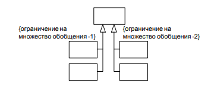

или пунктирной линии для отдельного множества обобщения


В рассмотренном ранее примере класс ```Человек``` в первом множестве обобщения может быть специализирован или
как ```Женщина```, или как ```Мужчина```. Поскольку это множество обобщения разбивается, каждый экземпляр ```Человек```
должен быть или ```Женщиной```, или ```Мужчиной```, т. е. он должен быть или одним, или другим, но не обоими. При этом
других классов данное множество обобщения не содержит. Таким образом, здесь имеет место
ограничение: ```{complete, disjoint}.```

Класс Человек во втором множестве обобщения может быть специализирован как ```Программист```, ```Руководитель Проекта```
и ```Бизнес-аналитик```. Это означает, что
экземпляры Человека могут быть подмножеством ```Программиста```, ```Руководителя Проекта``` и ```Бизнес-аналитика``` или
некоторой другой коллекции, которая содержит экземпляры, не относящиеся к указанным трем классам. Тем самым это
отношение представляет неполную классификацию. Поскольку в некоторых случаях программист или бизнес-аналитик могут
одновременно выполнять обязанности руководителя проекта, соответствующие подмножества экземпляров этих классов не будут
являться непересекающимися. Таким образом, здесь имеет место ограничение: ```{incomplete, overlapping}```.

### Агрегация

_Агрегация (aggregation)_ — направленное отношение между двумя классами, предназначенное для представления ситуации,
когда один из классов представляет собой некоторую сущность, которая включает в себя в качестве составных частей другие
сущности.

Агрегация имеет фундаментальное значение для описания структуры сложных систем, поскольку применяется для представления
системных взаимосвязей типа "часть-целое". Раскрывая внутреннюю структуру системы, агрегация показывает, из каких
элементов состоит система, и как они связаны между собой. С точки зрения модели отдельные части системы могут выступать
как в виде элементов, так и в виде подсистем, которые, в свою очередь, тоже могут состоять из подсистем или элементов.

Агрегация является частным случаем отношения ассоциации, от которой она наследует такие свойства, как имена концов
ассоциации, кратность и ограничения. Однако агрегациями могут быть только бинарные ассоциации. При этом семантика
данного отношения по своей сути описывает декомпозицию или разбиение сложной системы на более простые составные части,
которые при необходимости также могут быть подвергнуты декомпозиции.

Графически отношение агрегации изображается сплошной линией, один из концов которой представляет собой незакрашенный
внутри (пустой) ромб в качестве дополнительного обозначения терминала на агрегированном конце линии ассоциации. Ромб
агрегации по форме должен быть меньше, чем ромб в качестве нотации ассоциации. Этот ромб указывает на тот из классов,
который представляет собой "класс-целое" или класс-контейнер. Остальные классы являются его "частями".

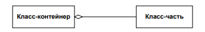

Если существуют две или более агрегации для одного агрегата, они могут
быть изображены в форме дерева посредством слияния концов агрегации
в отдельный сегмент. Любые дополнительные обозначения для этого отдельного сегмента применяются ко всем концам этой
агрегации. Примером
отношения агрегации может служить известное каждому из читателей разделение персонального компьютера на составные части:
системный блок, монитор, клавиатуру и мышь. Используя обозначения языка UML 2.0, компонентный состав ПК можно
представить в виде соответствующей диаграммы классов.

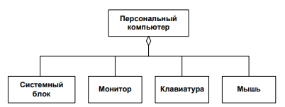

### Композиция

_Композиция (composition)_ или _композитная агрегация_ предназначена для спецификации более сильной формы отношения "
часть-целое", при которой с уничтожением объекта класса-контейнера уничтожаются и все объекты, являющиеся его составными
частями.

Отношение композиции является частным случаем отношения агрегации.
При этом она является сильной формой агрегации, которая требует, чтобы
экземпляр-часть был включен не более чем в один агрегат или композит. Если композит удаляется, все его части обычно
удаляются вместе с ним. В языке UML 2.0 объект-часть при необходимости может быть удален из композита до того, как сам
композит будет уничтожен.

Графически отношение композиции изображается сплошной линией, один из концов которой представляет собой ромб, который
имеет заливку ("черный ромб"). Этот ромб указывает на тот из классов, который представляет собой класс-композит.
Остальные классы являются его "частями".

Разработчикам необходимо помнить, что агрегация и композиция
представляют собой транзитивные асимметричные отношения, откуда следует обязательное требование — их связи образуют
направленный ациклический граф.

Для отношений композиции и агрегации могут использоваться дополнительные обозначения, применяемые для отношения
ассоциации. А именно могут указываться кратности отдельных классов, которые в общем случае не являются обязательными.
Однако кратность агрегированного конца композитной агрегации не должна иметь верхней границы больше чем 1. Применительно
к описанному ранее примеру класс ```Окно программы``` является классом-композитом, а взаимосвязи составляющих его частей
могут
быть изображены следующей диаграммой классов.

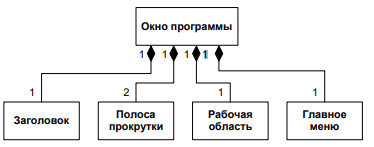

### Реализация

_Реализация (realization)_ — специализированное отношение зависимости между двумя элементами модели, один из которых
представляет некоторую спецификацию (поставщик), а другой представляет его реализацию (клиент).

Отношение реализации означает, что множество элементов клиента является
реализацией множества элементов поставщика, которое служит в качестве
спецификации. Зависимость реализации изображается в форме пунктирной
линии с треугольной стрелкой на конце, которая соответствует реализуемому
элементу. Так, например данный фрагмент иллюстрирует случай, когда класс ```Бизнес``` реализуется комбинацией
классов ```Владелец```
и ```Сотрудник```.

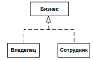

### Интерфейс

_Интерфейс (interface)_ — вид класса, который представляет собой объявление множества общедоступных характеристик и
обязанностей.

Интерфейс в языке UML 2.0 является специальным случаем класса, у которого, как правило, имеются операции и отсутствуют
атрибуты. Интерфейсы предназначены для спецификации таких операций класса, объявления которых видимы извне, однако
особенности их реализации скрыты от клиентов.

В этом смысле интерфейс не может существовать отдельно от класса, который реализует объявленные в нем операции. Если в
интерфейсе объявлен атрибут, то это вовсе не означает, что реализующий экземпляр класса должен обязательно иметь этот
атрибут в своей реализации, а только то, что этот атрибут будет представляться таким для внешних наблюдателей. Поскольку
интерфейс является только лишь объявлением, он не является инстанцируемым элементом модели, т. е. во время выполнения
экземпляры интерфейсов не существуют.

Интерфейс специфицирует некоторый контракт. Любой экземпляр класса, который реализует интерфейс, должен выполнять этот
контракт. Обязанности, которые могут быть ассоциированы с интерфейсом, могут быть заданы в форме различных видов
ограничений или спецификаций протоколов, которые накладывают ограничения на особенности взаимодействия с интерфейсом.
Спецификация интерфейса реализуется посредством экземпляра некоторого инстанцируемого класса. Следует заметить, что в
общем случае один класс может реализовывать более одного интерфейса и один интерфейс может быть реализован несколькими
различными классами. На диаграмме классов интерфейс изображается в виде маленького круга, рядом с которым записывается
его имя. В качестве имени может быть существительное, которое характеризует соответствующую информацию или сервис (
например, Датчик температуры, Форма ввода, Видеокамера). С учетом языка реализации модели имя интерфейса, как и имена
других классов, рекомендуется записывать на английском. В этом случае оно должно начинаться с заглавной буквы ```I```,
например, ```ITemperatureSensor```, ```ISecureInformation```.

Соответствующее отношение между классом и требуемым интерфейсом
представляется отношением зависимости использования от класса к интерфейсу. Оно изображается представлением интерфейса в
форме полукруга, помеченного именем интерфейса, присоединенного непрерывной линией
к классу, который требует этот интерфейс.

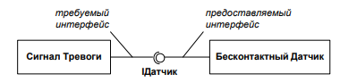

В данном примере ```IДатчик``` является предоставляемым интерфейсом для ```Бесконтактного Датчика``` и требуемым
интерфейсом для ```Сигнала Тревоги```.

Нотация предоставляемого и требуемого интерфейса в форме круга и полукруга получила свое собственное жаргонное
название — **"леденец на палочке"**, которое стало своеобразной визитной карточкой нововведений языка UML 2.0.

Как классификатор, интерфейс может быть также изображен с использованием символа прямоугольника с ключевым
словом ```<<interface>>```, записанным в форме стереотипа. В случае, когда интерфейс представляется с использованием
нотации прямоугольника, отношения зависимости реализации и использования интерфейса обозначаются стрелками
соответствующей зависимости.

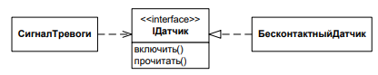

## Пример диаграммы классов в для системы продажи товаров в интернет-магазине

В качестве примера рассмотрим диаграмму классов для системы продажи товаров в интернет-магазине. Вообще говоря, подобная
диаграмма классов может быть построена и представлена различным образом, что отражает субъективный характер разработчика
на отдельные аспекты реализации модели.

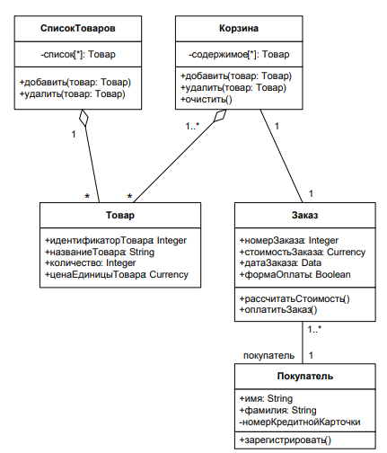

Данная диаграмма содержит 5 классов. Что касается состава операций классов и их видимостей, то их выбор определяется,
исходя из возможной программной реализации данной модели.

Что касается состава операций классов и их видимостей, то их выбор определяется, исходя из возможной программной
реализации данной модели.

# Элементы диаграммы классов UML

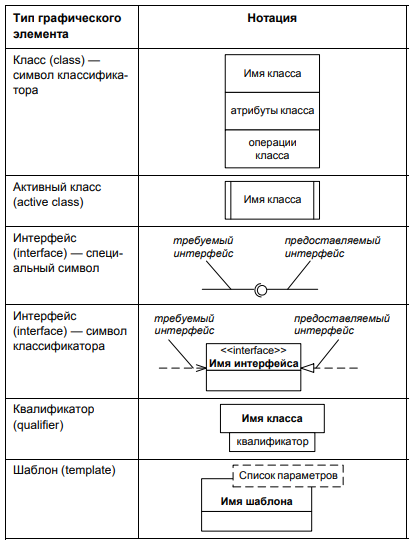

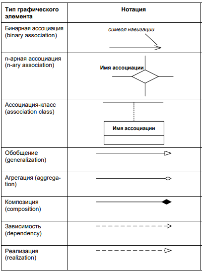